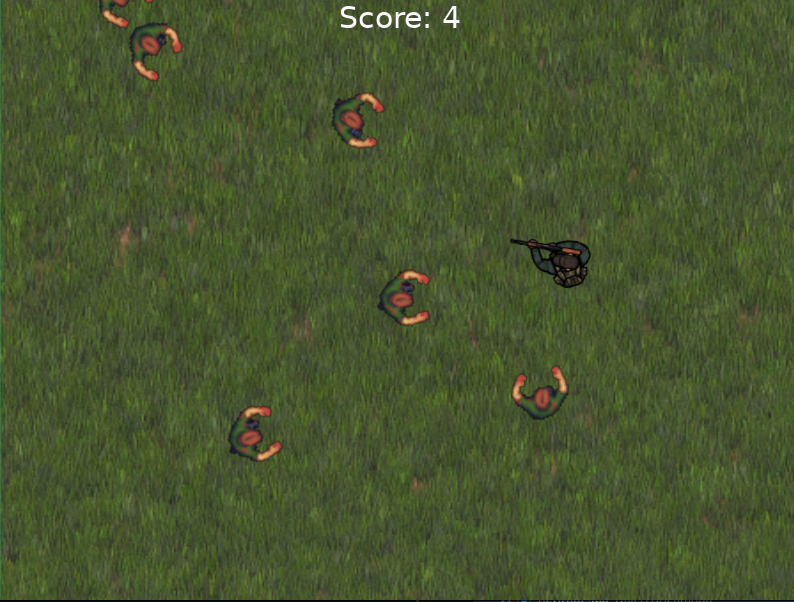

# Zombie Game



Este é um jogo simples de zumbi feito em Love Lua. O objetivo do jogo é sobreviver o maior tempo possível enquanto mata o maior número de zumbis que aparecem no mapa. O jogo termina quando o jogador é morto pelos zumbis.

## **Requisitos**

- Love2D 11.3 ou superior
- Lua 5.1 ou superior

## **Como Jogar**

Para iniciar o jogo, basta executar o arquivo **`main.lua`** com o Love2D.

- Use as teclas WASD para mover o personagem
- Use o mouse para apontar e atirar
- Mate o maior número de zumbis possível para aumentar a sua pontuação
- Quando o jogador é morto pelos zumbis, o jogo termina e a pontuação é exibida na tela.

### **Estrutura de pastas**

- **`entities`**: contém as entidades do jogo, como o personagem e os zumbis.
- **`controllers`**: contém os controladores das entidades, como o **`BulletsController`** que controla os tiros da arma e o **`EnemiesController`** que gerencia os inimigos no cenário.
- **`lib`**: contém bibliotecas criadas para o jogo, como o **`Animation.lua`** que cuida da animação dos frames das sprites.
- **`utils`**: contém funções compartilhadas no jogo, como a distância entre personagens e spawn de entidades no mapa.

## **Estrutura do Código**

Este jogo foi criado para testar diferentes modelos de arquitetura de jogos, padrões de projeto em Lua, e conceitos de classes e herança da linguagem Lua. O jogo é construído em cima de uma arquitetura de entidades e controladores de entidades. Cada entidade tem um controlador que define como ela se comporta no jogo. A máquina de estado está presente dentro do arquivo **`main.lua`** e controla o fluxo do jogo, mudando o estado do jogo em resposta às ações do jogador ou aos eventos do jogo.

## **Créditos**

Este jogo foi desenvolvido por Felipe Campinho construído com base nos ensinamentos aprendidos no curso de Lua Programming and Game Development with LÖVE, de Kyle Schaub. Os sprites dos personagens foram baixados do site [https://opengameart.org/](https://opengameart.org/) e os efeitos sonoros foram obtidos no site [pixabay.com](https://pixabay.com/). O código-fonte está disponível sob a licença MIT.

## **Requisitos de instalação**

Para executar o jogo, é necessário ter instalado o framework LÖVE. Para baixá-lo, acesse o site oficial: **[https://love2d.org/](https://love2d.org/)**

## **Como executar**

Para executar o jogo, basta navegar até o diretório onde o jogo está localizado e executar o seguinte comando:

```
love ZombieGame
```

Certifique-se de ter instalado o framework LÖVE antes de executar o jogo.